# 基于Android的语音文字识别系统——iTalk

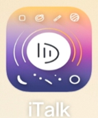

## 开发环境

android 13  --API 33

Android Gradle Plugin Version 7.3.0

Gradle Version 7.4

compileSdk 33

minSdk 16

targetSdk 33

ASR、TTS、OCR引擎分别集成百度Android SDK

## 功能测试

### 语音识别功能测试

#### l 实时语音识别

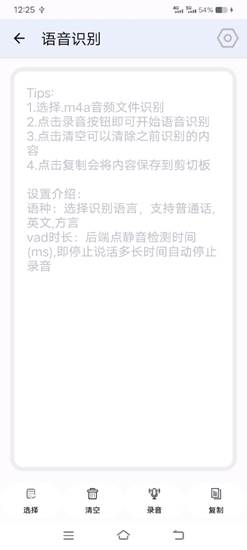                 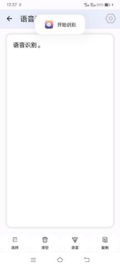

​             语音识别用户界面                                                    实时语音识别

 

#### l 音频文件语音识别

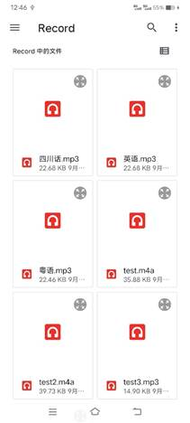                    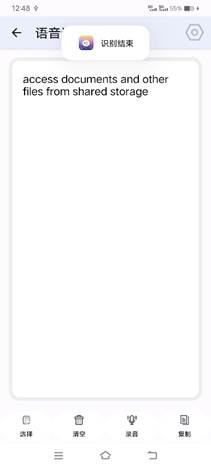

​         用户跳转选择音频文件                                     音频文件语音识别

#### l 语音识别设置页

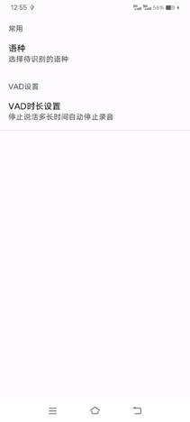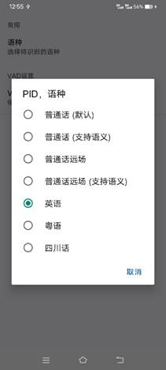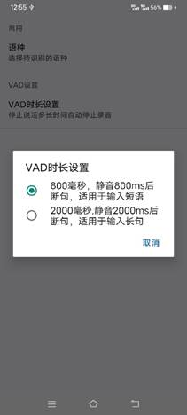     

​               ASR设置页                                 识别语种选择                           VAD时长设置

### 语音合成功能测试

#### l 用户直接键入合成内容

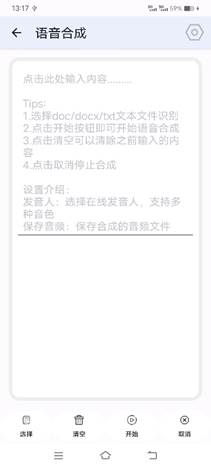                    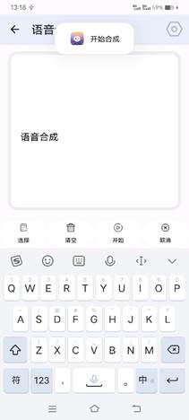

​           语音合成用户界面                                       用户直接键入合成

#### l 文本文件语音合成

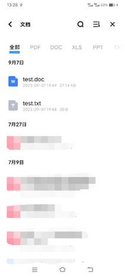                     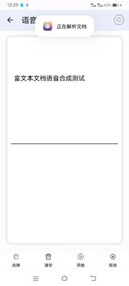

​    用户跳转选择文本文件                                           文档内容解析

#### l 语音合成设置页

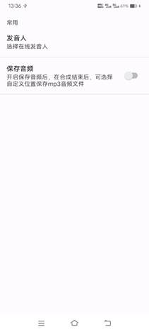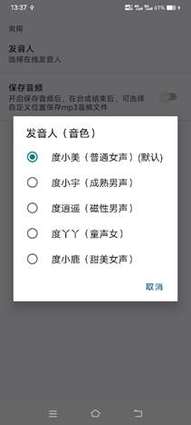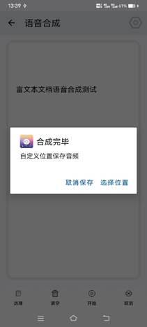    

​             TTS设置页                                    合成音色选择                              合成音频保存

### 文字识别功能测试

#### l 相机拍摄或相册选择图片识别文字

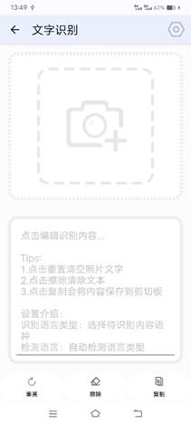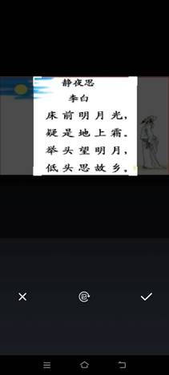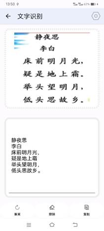 

​            文字识别用户界面                    图片确认ui                                     文字识别结果

#### l 文字识别设置页

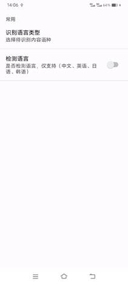                     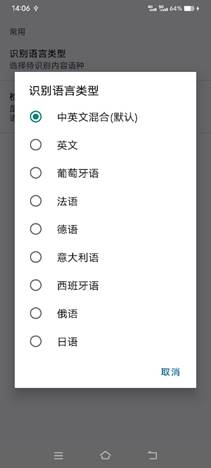

​             OCR设置页                                                识别语言类型选择

## FAQ

**1. :app模块 源码的pattern 包 作用？**

见pattern包下README文档

**2. Android版本适配？**

开发环境是api33版本即android 13，已经在Android 13真机测试，没有刻意去适配低版本

**3. [BuildFailed] Manifest merger failed : uses-sdk:minSdkVersion 16 cannot be smaller than version 24 declared in library [com.arthenica:mobile-ffmpeg-full:4.4]**

点击问题链接跳转问题文件，将其中的minSdkVersion="24"改为16即minSdkVersion="16"，然后重新build(Ctrl+F9)，再run

**4. 首次安装使用app时(调试时第一次下载到设备上或者发布安装包第一次下载)，ASR功能失效？**

临近作业deadline发现，无暇修改，不过只要用一下其他功能以后就会恢复正常，比如在首次安装时打开后发现用ASR没有任何识别结果，先用一下TTS或OCR，之后ASR就能正常识别，即使从新打开关闭也是正常的。这个问题仅在第一次安装app时出现。